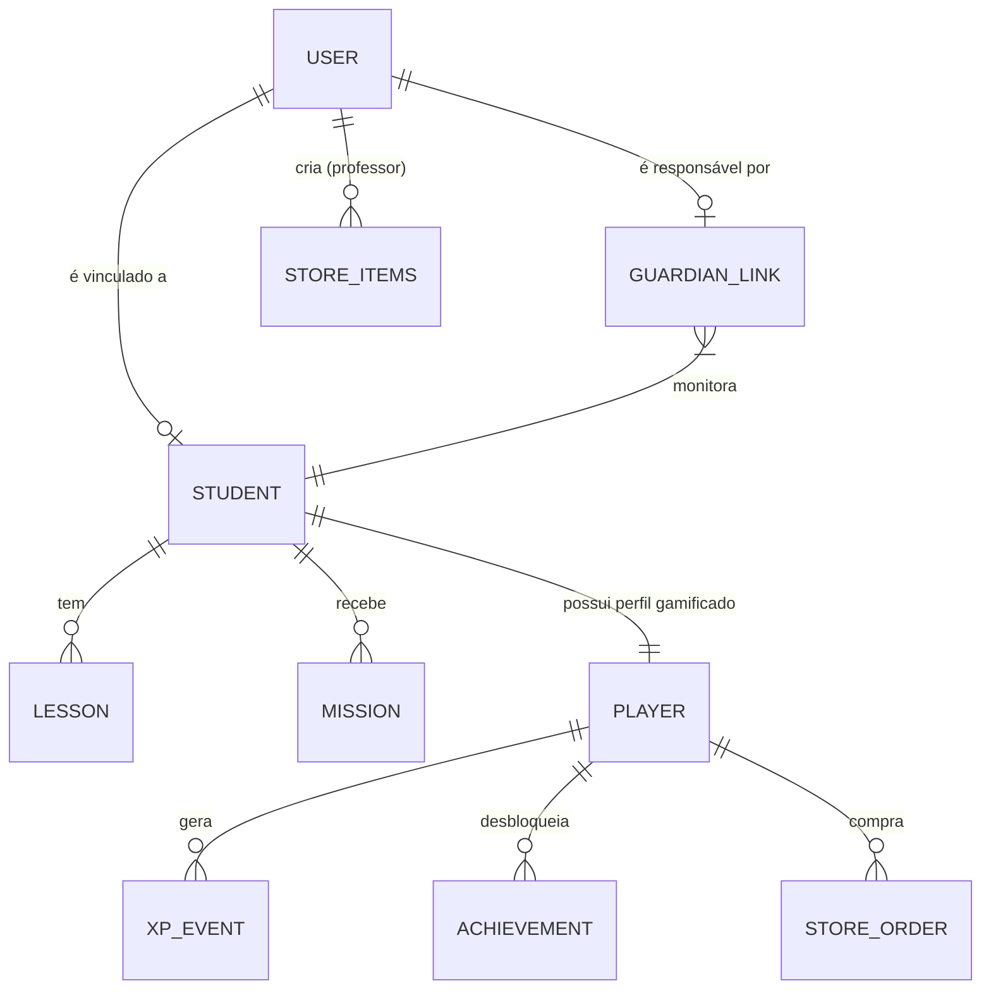

# Arquitetura Conceitual

## Visão Geral
O sistema opera como uma **Single Page Application (SPA)** hospedada no navegador, conectada a um **Backend-as-a-Service (BaaS)** para dados e autenticação.

**Stack:**
*   **Frontend:** React 18, Vite, Tailwind CSS, Framer Motion.
*   **Gerenciamento de Estado:** React Query (Server State) + Context API (Auth/Global UI).
*   **Backend:** Supabase (PostgreSQL, Auth, Realtime, Storage).
*   **Segurança:** RLS (Row Level Security) nativo do banco.

## Diagrama de Fluxo de Dados (Mermaid)

```mermaid
graph TD
    User[Usuário (Browser)] -->|HTTPS + JWT| Auth[Supabase Auth]
    User -->|HTTPS + REST/Realtime| API[Supabase API]
    
    subgraph "Backend (Supabase)"
        Auth -->|Valida Token| DB[(PostgreSQL)]
        API -->|Query c/ RLS| DB
        
        DB -->|Policies| RLS{Row Level Security}
        RLS -->|Permitido| Data[Dados JSON]
        RLS -->|Bloqueado| Error[403 Forbidden]
    end
    
    Data --> User
```

## Domínios e Fluxos

### 1. Domínio de Gestão (Pedagógico)
*   **Entidades:** `students`, `lessons`, `missions`.
*   **Fluxo:** Professor cria `student` -> Cria `mission` vinculada ao `student` -> Aluno lê e atualiza status da `mission`.

### 2. Domínio de Gamificação
*   **Entidades:** `players`, `xp_events`, `achievements`, `player_achievements`, `store_items`, `store_orders`.
*   **Fluxo:** Ações no sistema (completar missão, fazer login) disparam `xp_events`.
*   **Trigger:** O serviço `gamificationService.ts` calcula o novo saldo e nível, atualiza a tabela `players` e verifica desbloqueio de `achievements`.

### 3. Domínio Social (Vínculos)
*   **Entidades:** `guardian_student_link`.
*   **Fluxo:** Permite que um usuário com role `guardian` leia dados de um `student` específico através de policies RLS `EXISTS`.

## Modelo de Relacionamento (ERD Simplificado)



## Conexão com Supabase
Toda a lógica de permissão reside no banco de dados, definida no arquivo `src/sql/rls_policies.sql`. O frontend apenas reflete o que o usuário tem permissão para ver.
